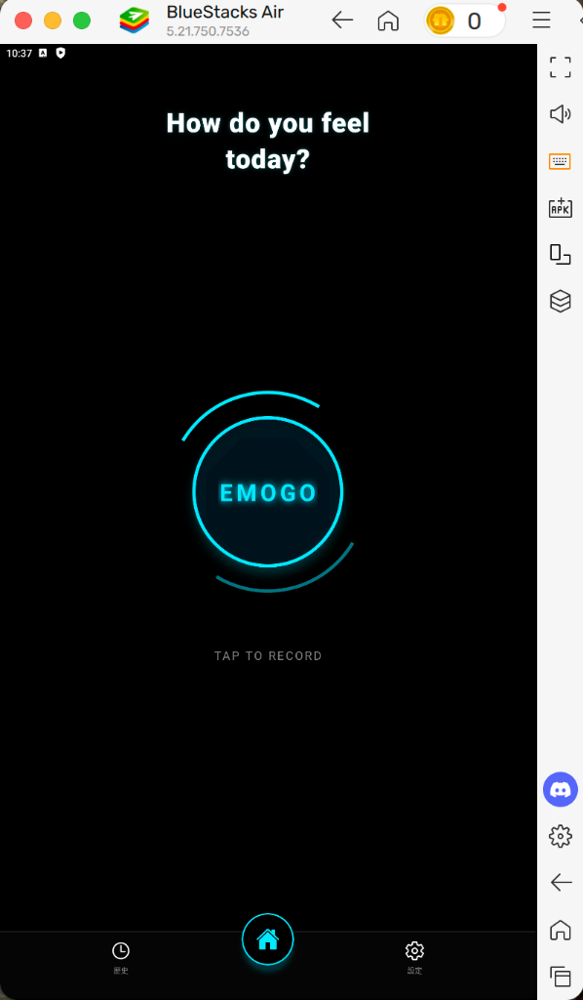

# EMOGO - Emotion Vlog Tracker

This project implements a comprehensive **Emotion Tracking Application** using **React Native** and **Expo**. It allows users to record daily mood vlogs, automatically captures **GPS location**, and stores data locally for privacy and personal analysis.

[View Android APK »](https://expo.dev/accounts/shihyun_lin/projects/expo-router-mwe/builds/fe9b7c8c-0610-407c-8fcc-d1c830fdc4d2) · [View iOS Build »](https://expo.dev/accounts/shihyun_lin/projects/expo-router-mwe/builds/2ea73f17-47ed-4df1-8ac4-98755e613cd0)

<br />

## Table of Contents

1. [About The Project](#-about-the-project)
2. [Core Features](#-core-features)
3. [App Screenshots](#-app-screenshots)
4. [Project Structure](#-project-structure)
5. [Getting Started](#-getting-started)
6. [Tech Stack](#-tech-stack)
7. [Contact](#-contact)

---

## 📖 About The Project

**EMOGO** is designed to provide a **private** and **interactive** way for users to track their emotional well-being.

Focusing on the concept of "Vlogging for Mental Health," this project creates a personal diary that combines video, quantitative mood scoring, and geospatial data. Users can look back at their history to understand emotional patterns in different contexts.

### Why EMOGO?
*   **Privacy-First**: All data is stored locally using SQLite; no external server is required for basic functionality.
*   **Contextual**: Captures not just *what* you feel (Mood Score), but *where* you are (GPS) and *why* (Video).
*   **Accessible**: Built with Expo for cross-platform compatibility (iOS & Android).

---

## ✨ Core Features

| Module | Description |
| :--- | :--- |
| **📹 Video Mood Log** | Records **10-second vlogs** to capture immediate thoughts and feelings. |
| **😊 5-Scale Scoring** | Quantifies emotions from **Sad** to **Great** for statistical tracking. |
| **📍 GPS Tracking** | Automatically extracts **[Latitude, Longitude]** during recording to map emotional contexts. |
| **💾 Local Database** | Uses **SQLite** for robust, offline-first data persistence. |
| **☁️ Data Export** | Converts all records into a **CSV format** for external analysis or backup. |
| **🔔 Notifications** | Daily reminders (09:00, 14:00, 20:00) to encourage consistent journaling. |

---

## 📸 App Screenshots

<p align="center">
  
</p>

---

## 📂 Project Structure

```plaintext
07-web-emogo-frontend/
├── 📱 app/
│   ├── (tabs)/              # Main Tab Navigation (Home, History, Settings)
│   ├── _layout.js           # Root Layout Configuration
│   └── record-mood.js       # Core Recording Interface
├── 📂 assets/               # Static Assets (Images, Icons)
├── 🧩 components/           # Reusable UI Components
├── 💾 database/             
│   └── db.js                # SQLite Database Initialization & Queries
├── 🛠️ utils/                
│   ├── export.js            # CSV Export Logic
│   ├── location.js          # GPS Location Services
│   └── notifications.js     # Push Notification Handler
├── 📄 package.json          # Dependencies & Scripts
└── 📄 README.md             # Project Documentation
```

---

## 🚀 Getting Started

### Prerequisites

This project is built with **Expo SDK 54** and **React Native 0.81.5**.
*   **Node.js**: LTS version recommended
*   **Expo Go App**: Install on your iOS/Android device for testing

### Installation

1.  **Clone the Repository**
    ```bash
    git clone <your-repo-url>
    cd 07-web-emogo-frontend
    ```

2.  **Install Dependencies**
    ```bash
    npm install
    ```

3.  **Start Development Server**
    ```bash
    npx expo start
    ```

---

## 🛠️ Tech Stack

*   **Framework**: React Native + Expo
*   **Routing**: Expo Router
*   **Database**: Expo SQLite
*   **Media**: Expo Camera, Expo Video
*   **Services**: Expo Location, Expo Notifications

---


### 📥 Download

*   **Android APK**: [Download Here](https://expo.dev/accounts/shihyun_lin/projects/expo-router-mwe/builds/fe9b7c8c-0610-407c-8fcc-d1c830fdc4d2)


## ⚖️ License

Distributed under the MIT License. See `LICENSE` for more information.

