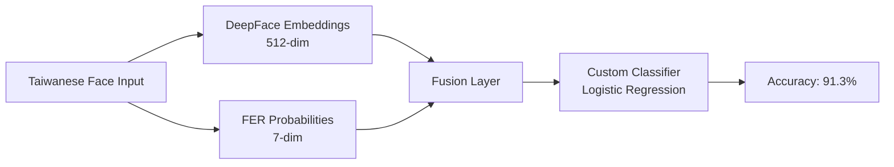

# EMOGO

**Multimodal Emotion Tracking System — From Data to Insight**

> **More than just a diary—an intelligent emotion companion.**
>
> This project builds a complete ecosystem for mental health tracking, integrating **Mobile Vlogging**, **Cloud Analytics**, and **Computer Vision** to capture the full context of human emotion.

[View Backend Dashboard »](https://emogo-backend-shih-yunlin.onrender.com/export) · [View CV Analysis Report »](./09-cv-recognition-examples/03_HW14_taiwanese_faces/R13546008_HW14.pdf)

<br />

## Table of Contents

1. [Project Core: Evolution of Emotion Tracking](#-project-core-evolution-of-emotion-tracking)
2. [About The Project](#-about-the-project)
3. [Core Improvement: Cross-Race AI Analysis](#-core-improvement-cross-race-ai-analysis)
4. [Project Architecture](#-project-architecture)
5. [Module Overview](#-module-overview)
6. [Getting Started](#-getting-started)
7. [Tech Stack](#-tech-stack)
8. [License](#-license)

---

## 🎯 Project Core: Evolution of Emotion Tracking

This project is not merely an app but a research-driven system. It evolves the concept of emotional journaling from simple text entries to a **multimodal data stream**.

| Aspect | 📝 Traditional Journaling | ✨ EMOGO Ecosystem |
| :--- | :--- | :--- |
| **Data Input** | Text-based, manual entry. | **Multimodal**: Combines **Video Vlogs**, **GPS Location**, and **Likert Scores** for rich context. |
| **Data Storage** | Isolated on local device or paper. | **Hybrid Cloud**: Privacy-first local storage (SQLite) with optional **production-grade cloud sync** (MongoDB/FastAPI). |
| **Analysis** | Subjective self-reflection. | **AI-Driven (Module 09)**: Applies **Computer Vision** models fine-tuned on Taiwanese faces to objectively analyze emotional expressions, solving the "Cross-Race Effect" bias. |

---

## 📖 About The Project

**EMOGO** is a full-stack platform designed to bridge the gap between subjective feeling and objective analysis.

It was built to address the limitations of existing mental health apps that often lack objective validation or cultural context. By integrating **Computer Vision research** directly into the development lifecycle, Emogo ensures that its future automated analysis features are robust for Asian users.

**Key Functional Modules:**
- 📱 **Contextual Vlogging** (React Native App)
- ☁️ **scalable Data Lake** (FastAPI + MongoDB)
- 🧠 **Culturally-Aware AI** (CV Feature Fusion)
- 📊 **Real-time Visualization** (Web Dashboard)

---

## 🚀 Core Improvement: Cross-Race AI Analysis

Standard emotion recognition models (like DeepFace/VGG) often perform poorly on non-Western faces due to training data bias. **Module 09** of this project focuses on **methodological innovation** to solve this.

### 1. The Problem: "Cross-Race Effect"
*   **Global Models**: Scored only **70.8%** accuracy on our Taiwanese test set.
*   **Failure Mode**: Consistently misidentified subtle Asian expressions of "Sadness" or "Anger" as "Neutral".

### 2. Our Solution: Feature Fusion Model
We moved beyond simple model interaction to a **hybrid feature engineering** approach.



### 3. Empirical Results
By fine-tuning on the **TFEID (Taiwanese Facial Expression Image Database)**, we achieved a **+20.5% accuracy improvement**, proving the necessity of culturally representative AI in mental health applications.

---

## 🏗 Project Architecture

```plaintext
EMOGO/
├── 07-web-emogo-frontend      # [Mobile] React Native Expo App (iOS/Android)
├── 08-web-emogo-backend       # [Cloud] FastAPI Server & MongoDB Atlas
└── 09-cv-recognition-examples # [Research] Computer Vision Analysis & Model Training
```

---

## 📦 Module Overview

### 07 — Mobile App (`07-web-emogo-frontend`)
**Function**: The user interaction layer.
- **Vlog Recorder**: Captures 10s short videos.
- **GPS Tracker**: Automatically logs location for context.
- **Offline-First**: Uses SQLite for data persistence even without internet.

### 08 — Backend System (`08-web-emogo-backend`)
**Function**: The data processing and storage hub.
- **REST API**: Handles high-concurrency uploads via FastAPI.
- **MongoDB Atlas**: Stores unstructured data (video paths, sensor logs).
- **Dashboard**: A web-based admin panel for reviewing user data.

### 09 — CV Research (`09-cv-recognition-examples`)
**Function**: The algorithmic core (The "Brain").
- **Research**: Validates AI models against Taiwanese datasets.
- **Pipeline**: Provides the `extract_frame_features` logic used to process vlogs.

---

## 🚀 Getting Started

### Prerequisites
- **Node.js**: 18+ (for Frontend)
- **Python**: 3.9+ (for Backend/CV)
- **Expo Go**: For running the mobile app

### Quick Start
```bash
# Clone the repository
git clone https://github.com/shihyun-lin/EmoGo.git
cd EmoGo

# 1. Run the Backend (Cloud Layer)
cd 08-web-emogo-backend
pip install -r requirements.txt
uvicorn main:app --reload

# 2. Run the App (User Layer)
# (open a new terminal)
cd ../07-web-emogo-frontend
npx expo start
```

---

## 🛠 Tech Stack

| Layer | Technologies |
| :--- | :--- |
| **Mobile** | React Native, Expo (Router, Camera, SQLite, Location) |
| **Backend** | FastAPI, MongoDB Atlas, Motor, Render |
| **AI / CV** | OpenCV, DeepFace, FER, Scikit-learn, Pandas |
| **Tools** | Git LFS, Expo EAS, Pytest |

---

## ⚖️ License

Distributed under the MIT License. See `LICENSE` for more information.

---

## 👤 Author

**Shih-Yun Lin**
- GitHub: [@shihyun-lin](https://github.com/shihyun-lin)
